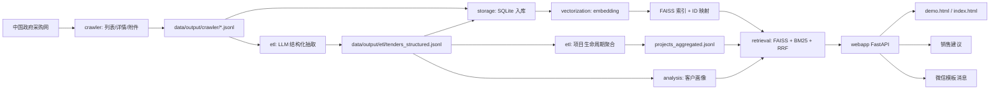

# Sales Agent 项目说明文档

> 生成日期：2026-04-29  
> 说明范围：当前仓库 `/home/sylincom/sales-agent` 的代码、文档、数据产物和部署脚本。  
> 注意：本文不会展开源码中的 API Key、代理账号、内网服务地址等敏感值；如需调整，请优先迁移到环境变量或独立 `.env` 文件。

---

## 1. 项目概览

Sales Agent 是一个面向销售团队的政府采购招投标情报系统。项目围绕“中国政府采购网”标讯数据构建完整链路：

```text
数据采集 -> 详情抓取/附件处理 -> LLM 结构化抽取 -> SQLite 入库
       -> 客户画像/项目生命周期聚合 -> 向量化与索引构建
       -> FAISS + BM25 混合检索 -> Web 前端/销售建议/微信通知
```

核心目标是把零散公告转化为可检索、可评分、可用于销售跟进的项目机会：

- 自动采集招标公告、结果公告、更正公告等数据。
- 使用 LLM 提取采购单位、预算、产品关键词、技术要求、联系人、机会评分等结构化字段。
- 聚合同一项目的多个公告，形成项目生命周期视图。
- 基于产品库对招标库做语义检索和关键词检索，给出匹配项目。
- 结合客户画像生成销售建议，并支持 Web 展示和微信模板消息推送。

---

## 2. 当前工程状态

| 项目 | 当前状态 |
| --- | --- |
| 主项目目录 | `get_data/` |
| 当前部署入口 | `get_data/webapp/server_fastapi.py`，systemd/脚本均指向 `webapp.server_fastapi:app` |
| Web 访问 | `http://127.0.0.1:8103/static/demo.html`、`/static/index.html`、`/docs` |
| 数据库 | `get_data/data/ccgp_data.db`，约 37 MB |
| 当前 SQLite 数据量 | `tenders=478`，`tender_structured=476`，`customer_profiles=311`，`tender_chunks=0`，`tender_attachments=0` |
| 当前 JSONL 数据量 | 列表 2454 行，详情 2447 行，结构化 2447 行，项目聚合 2240 行，客户画像 619 行 |
| 当前索引 | 产品索引 10 条，标讯索引 476 条 |
| 前端技术 | 静态 HTML/CSS/Vanilla JS，部分页面直接内联脚本 |
| 后端技术 | Python + FastAPI + Uvicorn + SQLite |
| 检索技术 | FAISS 向量检索 + jieba/BM25 关键词检索 + RRF 融合 |
| LLM 接入 | OpenAI 兼容接口，默认本地 LLM，也保留 DeepSeek/DashScope/Doubao 配置 |
| 测试目录 | `get_data/tests/`，包含 crawler/etl/utils 基础测试 |

本轮已完成的代码优化：

- `DualRetriever.hybrid_search()` 已支持 `use_vector`、`use_bm25`、`city` 参数，修复 `/api/retrieval/direct-search` 参数不匹配问题。
- 结构化抽取默认读取 `tenders_detail.jsonl`，并兼容 JSON 数组和 JSONL 两种详情输入。
- `vectorize_data.py`、`build_index.py`、`aggregate_projects.py` 已提供跨平台 CLI，不再依赖 Windows 绝对路径。
- `config.py` 已移除明显的 DeepSeek Key、代理账号/密码硬编码，改为从环境变量读取。
- 新增检索器参数测试和结构化抽取 JSONL 输入测试。

生成本文档时，工作区有未提交变更，包括若干旧文件删除、新增 `AGENTS.md`、`get_data/src/README.md`、`get_data/webapp/DEPLOYMENT.md`、`start_server.sh`、`sales-api.service` 等。本文以当前文件系统内容为准。

---

## 3. 技术栈

| 层级 | 技术/库 | 用途 |
| --- | --- | --- |
| 语言 | Python 3.10+ | 爬虫、ETL、API、检索、分析 |
| Web API | FastAPI、Uvicorn、Pydantic | 后端服务和接口文档 |
| 数据库 | SQLite | 本地结构化数据存储 |
| 爬虫 | curl_cffi、requests、BeautifulSoup、DrissionPage、scrapling | 政府采购网列表/详情/附件采集 |
| LLM | openai SDK，OpenAI-compatible API | 结构化抽取、销售建议、附件技术参数提取 |
| 向量检索 | faiss-cpu、numpy | 向量索引和相似度召回 |
| 关键词检索 | jieba、rank-bm25 | 中文分词和 BM25 召回 |
| 数据处理 | pandas、openpyxl | CRM/Excel 数据读取与分析 |
| 附件解析 | pypdf、python-docx、python-pptx、rarfile | PDF/Office/压缩包等附件处理 |
| 前端 | HTML、CSS、Vanilla JS、Tailwind CDN 风格 | Demo 页面和完整后台页面 |
| 部署 | Shell 脚本、systemd | 常驻 API 服务 |

---

## 4. 目录结构

```text
sales-agent/
├── README.md                         # 项目总览
├── demo.py                           # 本地演示脚本
├── test_local_llm.py                 # 本地 LLM 连通性测试
├── docs/                             # 根级业务方案、报告、数据样例
│   ├── PIPELINE_GUIDE.md
│   ├── hybrid_search_plan.md
│   ├── hybrid_search_technical_report.md
│   └── 项目说明文档.md               # 本文档
└── get_data/                         # 主工程目录
    ├── README.md
    ├── requirements.txt
    ├── data/                         # SQLite、JSONL、embedding、FAISS 索引、附件
    ├── docs/                         # 入门、RAG、架构、运维、开发指南
    ├── logs/                         # 运行日志
    ├── src/                          # 核心源码
    ├── tests/                        # 测试与校验脚本
    ├── tools/                        # 早期工具/插件式 executor
    └── webapp/                       # FastAPI 服务、路由、前端静态页面、部署脚本
```

`get_data/src/` 是核心源码目录：

```text
src/
├── config.py                         # 全局路径、LLM、爬虫、Embedding、索引配置
├── models.py                         # 结构化字段模板和 JSON Schema
├── crawler/                          # 列表页、详情页、附件链接/下载、代理池
├── etl/                              # 结构化抽取、RAG 分块、附件技术参数、项目聚合
├── storage/                          # JSONL -> SQLite 入库、UUID 迁移、CLI
├── vectorization/                    # Embedding 生成和 FAISS 索引构建
├── retrieval/                        # DualRetriever 混合检索
├── analysis/                         # 客户画像、CRM 融合、销售建议
├── agent/                            # Agentic RAG 与可插拔 Skill
├── api/                              # 较早的模块化 FastAPI 服务入口
├── integration/                      # 微信客服系统对接
└── utils/                            # JSONL、日志等通用工具
```

`get_data/webapp/` 当前承担生产/演示服务：

```text
webapp/
├── server_fastapi.py                 # 当前主 FastAPI 服务，部署脚本直接引用
├── utils.py                          # Web 辅助函数
├── router/                           # 模块化路由文件，当前主服务未统一挂载全部 router
├── static/
│   ├── demo.html                     # 推荐演示页面
│   ├── index.html                    # 完整管理页面入口
│   ├── app.js
│   └── styles.css
├── start_server.sh                   # 开发/临时部署启停脚本
├── sales-api.service                 # systemd 服务配置
└── DEPLOYMENT.md                     # 部署与运维说明
```

---

## 5. 核心架构



### 5.1 数据采集层

主要文件：

- `get_data/src/crawler/ccgp_crawler.py`：搜索列表页爬虫，输出 `data/output/crawler/tenders_list.jsonl`。
- `get_data/src/crawler/crawl_detail.py`：详情页爬虫，输出 `data/output/crawler/tenders_detail.jsonl`。
- `get_data/src/crawler/batch_crawl_attachments.py`：批量提取附件链接。
- `get_data/src/crawler/download_attachments.py`：下载附件并更新附件状态。
- `get_data/src/crawler/proxy_manager.py`：代理池管理。

采集配置集中在 `get_data/src/config.py` 的 `CRAWLER_CONFIG`，包括关键词、页数、时间范围、搜索类型、代理配置、请求超时等。

### 5.2 入库层

主要文件：

- `get_data/src/storage/import_tenders.py`：导入列表、详情、附件数据到 `tenders` 和 `tender_attachments`。
- `get_data/src/storage/import_structured.py`：导入 LLM 结构化结果到 `tender_structured`。
- `get_data/src/storage/import_customer_profiles.py`：导入客户画像到 `customer_profiles`。
- `get_data/src/storage/cli.py`：入库命令封装。
- `get_data/src/storage/migrate_uuids.py`：补齐历史数据 UUID。

SQLite 数据库路径：`get_data/data/ccgp_data.db`。

### 5.3 ETL 与结构化抽取

主要文件：

- `get_data/src/etl/core/extract_structured.py`：调用 LLM 抽取结构化字段。
- `get_data/src/etl/core/prompt_extract.md`：结构化抽取 Prompt。
- `get_data/src/etl/aggregate_projects.py`：按“标准项目名 + 采购人”聚合同一项目公告，输出项目生命周期。
- `get_data/src/etl/chunks/generate_chunks.py`：生成 `tender_chunks`，用于 RAG。
- `get_data/src/etl/chunks/import_attachment_chunks.py`：把附件解析结果切块入库。
- `get_data/src/etl/attachments/extract_attachment_specs.py`：解析 PDF/Word/TXT 等附件，提取技术参数。

结构化结果主要字段：

- 基础信息：`project_name`、`buyer_name_std`、`agency_name_std`、`province`、`city`
- 预算与中标：`budget_amount`、`budget_unit`、`winning_bidder`、`winning_amount`
- 需求信息：`product_keywords`、`application_scenario`、`technical_requirements_summary`、`content_summary`
- 联系信息：`contact_person`、`contact_phone`、`buyer_contacts`、`agency_contacts`、`project_contacts`
- 销售判断：`opportunity_score`、`opportunity_reason`、`next_action`

### 5.4 向量化与索引

主要文件：

- `get_data/src/vectorization/vectorize_data.py`：调用 Embedding API 生成向量，保存到 `data/embedding/*.jsonl`。
- `get_data/src/vectorization/build_index.py`：使用 `faiss.IndexFlatIP` 构建索引，并写出 ID 映射。

当前产物：

| 数据 | 原始/向量文件 | 索引 | ID 映射 |
| --- | --- | --- | --- |
| 产品 | `data/embedding/product_embedded.jsonl` | `data/index/product.index` | `data/index/product_ids.json` |
| 标讯 | `data/embedding/tenders_embedded.jsonl` | `data/index_tenders/tenders.index` | `data/index_tenders/tenders_ids.json` |

### 5.5 检索层

核心类：`get_data/src/retrieval/retriever.py` 的 `DualRetriever`。

检索逻辑：

1. 加载 FAISS 索引、ID 映射和 embedding JSONL。
2. 对原始数据构建 jieba 分词后的 BM25 语料。
3. 向量检索召回语义相似结果。
4. BM25 召回关键词精确匹配结果。
5. 使用 RRF（Reciprocal Rank Fusion）融合两路排名。
6. 对标讯检索可按项目聚合，引用 `projects_aggregated.jsonl`，并支持排除已中标项目、按日期排序、客户价值加权。

当前 `DualRetriever.hybrid_search()` 支持参数：

```python
hybrid_search(
    query_text,
    top_k=10,
    query_vector=None,
    vector_weight=0.5,
    bm25_weight=0.5,
    province=None,
    notice_type=None,
    aggregate_by_project=True,
    exclude_won=False,
    sort_by="score",
    client_value_weight=0.0,
)
```

### 5.6 分析与客户画像

主要文件：

- `get_data/src/analysis/generate_customer_profiles.py`：从结构化标讯聚合客户画像。
- `get_data/src/analysis/crm_loader.py`：读取商机/线索 Excel。
- `get_data/src/analysis/profile_unifier.py`：统一招标画像和 CRM 画像格式。
- `get_data/src/analysis/profile_enhancer.py`：融合招标数据和 CRM 数据。
- `get_data/src/analysis/sales_advisor.py`：调用 LLM 生成销售建议，并缓存到 `data/output/sales_suggestions/suggestions.jsonl`。

客户画像维度：

- 基础信息：客户名称、地区、行业/类型。
- 价值评估：历史招标次数、总预算、平均机会评分。
- 需求偏好：技术关键词、应用场景。
- 竞争态势：历史中标单位、竞争格局。
- 联系方式：联系人、电话、客户服务信息。

### 5.7 Agentic RAG

主要文件：

- `get_data/src/agent/sales_agent.py`：多轮 Agent 主类。
- `get_data/src/agent/skills/base.py`：Skill 基类与结果对象。
- `get_data/src/agent/skills/registry.py`：Skill 注册中心。
- `get_data/src/agent/skills/search_tenders.py`：招标检索 Skill。
- `get_data/src/agent/skills/customer_profile.py`：客户画像查询和列表 Skill。
- `get_data/src/agent/skills/sales_suggestions.py`：销售建议和项目分析 Skill。

该模块目前更像 SDK/后续能力基础，Web 主服务主要直接调用检索器、客户画像和销售建议类。

### 5.8 Web 与集成层

当前主服务：`get_data/webapp/server_fastapi.py`。

服务启动时会：

- 初始化 `DualRetriever(data_type="product")` 和 `DualRetriever(data_type="tender")`。
- 初始化 `SalesAdvisor()`。
- 加载 `data/output/customer/customer_profiles.jsonl` 到内存。
- 挂载 `webapp/static/` 到 `/static`。

微信集成在 `get_data/src/integration/wechat_service.py`，通过外部客服系统 API 查询用户和发送模板消息。

---

## 6. 数据资产与表结构

### 6.1 文件型数据

| 路径 | 当前规模 | 说明 |
| --- | ---: | --- |
| `get_data/data/output/crawler/tenders_list.jsonl` | 2454 行 / 540 KB | 列表页采集结果 |
| `get_data/data/output/crawler/tenders_detail.jsonl` | 2447 行 / 15 MB | 详情页采集结果 |
| `get_data/data/output/etl/tenders_structured.jsonl` | 2447 行 / 6.7 MB | LLM 结构化结果 |
| `get_data/data/output/etl/projects_aggregated.jsonl` | 2240 行 / 4.6 MB | 项目生命周期聚合结果 |
| `get_data/data/output/customer/customer_profiles.jsonl` | 619 行 / 1.5 MB | 客户画像结果 |
| `get_data/data/product.jsonl` | 10 行 / 11 KB | 产品库 |
| `get_data/data/embedding/tenders_embedded.jsonl` | 476 行 / 13 MB | 已向量化标讯 |
| `get_data/data/embedding/product_embedded.jsonl` | 10 行 / 241 KB | 已向量化产品 |
| `get_data/data/index_tenders/tenders.index` | 1.9 MB | 标讯 FAISS 索引 |
| `get_data/data/index/product.index` | 41 KB | 产品 FAISS 索引 |

### 6.2 SQLite 表

当前数据库表：

```text
tenders
tender_structured
tender_chunks
tender_attachments
customer_profiles
crawl_logs
```

核心表说明：

| 表 | 当前行数 | 说明 |
| --- | ---: | --- |
| `tenders` | 478 | 标讯列表/详情基础表 |
| `tender_structured` | 476 | LLM 抽取后的结构化标讯 |
| `tender_chunks` | 0 | RAG 分块表，当前库中尚未写入 |
| `tender_attachments` | 0 | 附件表，当前库中尚未写入 |
| `customer_profiles` | 311 | 入库后的客户画像 |

`tenders` 主要字段：

```text
id, uuid, project_name, publish_date, detail_url, content,
attachment_urls, buyer_name, agency_name, budget, status, created_at
```

`tender_structured` 主要字段：

```text
id, uuid, tender_id, publish_date, source_url, project_name,
buyer_name_std, agency_name_std, province, city,
budget_amount, budget_unit, product_keywords, application_scenario,
technical_requirements_summary, content_summary,
winning_bidder, winning_amount, winning_product,
contact_person, contact_phone,
buyer_contacts, agency_contacts, project_contacts,
opportunity_score, opportunity_reason, next_action,
llm_model, created_at
```

`tender_chunks` 主要字段：

```text
chunk_id, tender_id, tender_uuid, chunk_type, chunk_text,
chunk_order, metadata_json, embedding_id, created_at
```

`customer_profiles` 主要字段：

```text
id, customer_name, province, city, industry,
tech_keywords, application_scenarios,
tender_count, total_budget, avg_opportunity_score,
past_winners, contact_info, full_profile_json,
last_updated, created_at
```

---

## 7. 主要 API

### 7.1 当前主服务 API：`webapp/server_fastapi.py`

| 方法 | 路径 | 说明 |
| --- | --- | --- |
| `GET` | `/` | 服务状态、Demo 页面和 Swagger 链接 |
| `GET` | `/api/retrieval/product-options` | 获取产品下拉列表 |
| `POST` | `/api/retrieval/search-tenders` | 按产品检索标讯，供 Demo 页面使用 |
| `POST` | `/api/retrieval/direct-search` | 后端对接用产品检索接口，参数更完整 |
| `GET` | `/api/retrieval/filter-options` | 获取省份和公告类型筛选项 |
| `GET` | `/api/customer/profile/{customer_name}` | 按客户名称或信用代码获取画像 |
| `GET` | `/api/customers` | 客户分页列表，支持搜索和类型筛选 |
| `GET` | `/api/customers/all` | 客户简要列表 |
| `POST` | `/api/analysis/sales-suggestions` | 根据项目和客户画像生成销售建议 |
| `GET` | `/api/db/tables` | 查看 SQLite 表名 |
| `GET` | `/api/db/table/{table_name}` | 分页查看表数据 |
| `GET` | `/api/wechat/users` | 查询外部客服系统微信用户 |
| `POST` | `/api/wechat/template/send` | 单用户发送微信模板消息 |
| `POST` | `/api/wechat/template/broadcast` | 多用户广播模板消息 |
| `POST` | `/api/wechat/tender-notify` | 招标更新通知，面向已关注用户广播 |

`POST /api/retrieval/search-tenders` 请求示例：

```json
{
  "product_id": "产品 UUID 或 ID",
  "top_k": 20,
  "min_score": 0.0,
  "use_vector": true,
  "use_bm25": true,
  "vector_weight": 0.5,
  "bm25_weight": 0.5,
  "province": "北京",
  "notice_type": "招标公告",
  "exclude_won": false,
  "sort_by": "score",
  "client_value_weight": 0.0
}
```

### 7.2 较早的模块化 API：`src/api/main.py`

`get_data/src/api/main.py` 是另一个 FastAPI 入口，默认端口 `8000`，挂载了：

- `/api/tenders/{tender_id}`
- `/api/tenders/{tender_id}/chunks`
- `/api/search`
- `/api/search/filters`
- `/api/stats/overview`
- `/api/stats/by_province`
- `/api/stats/by_type`

该入口与当前部署脚本无直接关系，适合作为旧版 API 或后续模块化重构参考。

### 7.3 `webapp/router/` 路由状态

`get_data/webapp/router/` 下有 `crawl.py`、`extract.py`、`retrieval.py`、`db.py`、`intel.py`、`output.py`、`system.py` 等模块化路由。当前主服务 `server_fastapi.py` 并没有统一 `include_router()` 挂载这些文件，因此文档和前端若引用这些 router 中的接口，需要确认实际启动入口是否为已删除/旧版 `webapp/server.py`，或补充挂载逻辑。

---

## 8. 运行与部署

### 8.1 安装依赖

```bash
cd /home/sylincom/sales-agent/get_data
pip install -r requirements.txt
```

建议使用独立虚拟环境或 Conda 环境。`start_server.sh` 会按顺序查找：

1. `/home/sylincom/sales-agent/venv`
2. `/home/sylincom/sales-agent/get_data/venv`
3. `/home/sylincom/sales-agent/get_data/.venv`
4. 系统 `python3` 和 `uvicorn`

### 8.2 启动当前 Web 服务

开发/临时部署：

```bash
cd /home/sylincom/sales-agent/get_data/webapp
./start_server.sh start
./start_server.sh status
./start_server.sh log
./start_server.sh stop
```

直接运行：

```bash
cd /home/sylincom/sales-agent/get_data
python webapp/server_fastapi.py
```

或使用 uvicorn：

```bash
cd /home/sylincom/sales-agent/get_data
uvicorn webapp.server_fastapi:app --host 0.0.0.0 --port 8103 --workers 1 --log-level info
```

访问地址：

- Demo：`http://127.0.0.1:8103/static/demo.html`
- 完整页：`http://127.0.0.1:8103/static/index.html`
- Swagger：`http://127.0.0.1:8103/docs`
- Redoc：`http://127.0.0.1:8103/redoc`

### 8.3 systemd 部署

服务文件：`get_data/webapp/sales-api.service`。

```bash
sudo cp /home/sylincom/sales-agent/get_data/webapp/sales-api.service /etc/systemd/system/
sudo systemctl daemon-reload
sudo systemctl start sales-api
sudo systemctl enable sales-api
sudo systemctl status sales-api
journalctl -u sales-api -f
```

标准输出和错误会追加到：

- `get_data/logs/api_server/server_fastapi_stdout.log`
- `get_data/logs/api_server/server_fastapi_stderr.log`

---

## 9. 数据流水线操作手册

以下命令以 `get_data/` 为工作目录。

### 9.1 爬取公告列表

```bash
cd /home/sylincom/sales-agent/get_data
python src/crawler/ccgp_crawler.py --pages 100
```

输出：`data/output/crawler/tenders_list.jsonl`。

当前 CLI 实际支持参数：

- `--pages N`：爬取页数，`0` 表示尽量爬完所有页。

### 9.2 爬取详情

```bash
python src/crawler/crawl_detail.py --limit 100 --workers 8
```

常用参数：

- `--limit N`：本批最多爬取 N 条。
- `--serial`：串行爬取。
- `--workers N`：并发通道数。
- `--list-json PATH`：指定列表 JSON 路径。

输出：`data/output/crawler/tenders_detail.jsonl`。

### 9.3 入库列表/详情/附件

```bash
python src/storage/import_tenders.py --all
```

可选参数：

- `--list`：只导入列表。
- `--detail`：只更新详情。
- `--attachments`：只导入附件。
- `--all`：列表 + 详情 + 附件。

### 9.4 结构化抽取

当前 `extract_structured.py` 的 CLI 支持：

```bash
python src/etl/core/extract_structured.py --all --provider local --workers 8 --from-json data/output/crawler/tenders_detail.jsonl
```

常用参数：

- `--limit N`：处理 N 条。
- `--all`：处理所有记录。
- `--test-first`：只测试第一条。
- `--no-llm`：不调用 LLM。
- `--provider deepseek|local`：选择 LLM 提供商。
- `--model MODEL`：覆盖模型 ID。
- `--workers N`：并发线程数。
- `--retry`：重新抽取失败记录。
- `--from-json [PATH]`：指定详情 JSON/JSONL；默认读取 `data/output/crawler/tenders_detail.jsonl`。

### 9.5 导入结构化结果

```bash
python src/storage/import_structured.py --json data/output/etl/tenders_structured.jsonl --mode replace
```

参数：

- `--json PATH`：结构化 JSONL 路径。
- `--mode append|replace`：追加或覆盖。

### 9.6 生成客户画像

```bash
python src/analysis/generate_customer_profiles.py
python src/storage/import_customer_profiles.py --json data/output/customer/customer_profiles.jsonl
```

如需融合 CRM Excel，可进一步使用 `crm_loader.py`、`profile_unifier.py`、`profile_enhancer.py`。

### 9.7 项目生命周期聚合

`aggregate_projects.py` 可把结构化标讯按项目聚合：

```bash
python src/etl/aggregate_projects.py \
  --structured-file data/output/etl/tenders_structured.jsonl \
  --detail-file data/output/crawler/tenders_detail.jsonl \
  --output-file data/output/etl/projects_aggregated.jsonl \
  --profile-file data/output/customer/customer_profiles.jsonl
```

### 9.8 生成 RAG chunks

```bash
python src/etl/chunks/generate_chunks.py --all --replace
python src/etl/chunks/import_attachment_chunks.py --import
```

当前数据库中 `tender_chunks=0`，说明这一步还未对当前库生效，或生成结果没有导入当前 SQLite。

### 9.9 向量化与索引

`vectorize_data.py` 和 `build_index.py` 已支持 argparse：

```bash
python src/vectorization/vectorize_data.py --type all
python src/vectorization/build_index.py --type all
```

也可以只处理单类数据：

```bash
python src/vectorization/vectorize_data.py --type tender \
  --tender-input data/output/etl/tenders_structured.jsonl \
  --tender-output data/embedding/tenders_embedded.jsonl
python src/vectorization/build_index.py --type tender
```

它会读取：

- `data/embedding/product_embedded.jsonl`
- `data/embedding/tenders_embedded.jsonl`

并写出：

- `data/index/product.index`
- `data/index/product_ids.json`
- `data/index_tenders/tenders.index`
- `data/index_tenders/tenders_ids.json`

---

## 10. 配置说明

核心配置文件：`get_data/src/config.py`。

重要配置组：

| 配置 | 说明 |
| --- | --- |
| `BASE_DIR` | 默认根据 `config.py` 位置推导，也可用 `SALES_AGENT_BASE_DIR` 覆盖 |
| `DATA_DIR` | `get_data/data` |
| `DB_PATH` | `get_data/data/ccgp_data.db` |
| `CRAWLER_CONFIG` | 政府采购网搜索参数、页数、时间、代理配置 |
| `LOCAL_LLM_CONFIG` | 本地 OpenAI 兼容 LLM 服务 |
| `DEEPSEEK_CONFIG` | DeepSeek 服务配置 |
| `DASHSCOPE_CONFIG` / `QWEN_CONFIG` | 阿里云 DashScope 配置 |
| `DOUBAO_CONFIG` | 火山方舟豆包配置 |
| `EMBEDDING_CONFIG` | Embedding 服务、模型、维度 |
| `INDEX_DIR` | 产品索引目录 |
| `TENDER_INDEX_DIR` | 标讯索引目录 |
| `OUTPUT_DIR` | 所有数据输出目录 |

环境变量：

- `LLM_PROVIDER`：默认 LLM 提供商，源码默认 `local`。
- `SALES_AGENT_BASE_DIR`
- `LOCAL_LLM_API_KEY`
- `LOCAL_LLM_BASE_URL`
- `LOCAL_LLM_MODEL`
- `LOCAL_LLM_TIMEOUT`
- `DEEPSEEK_API_KEY`
- `DASHSCOPE_API_KEY`
- `ARK_API_KEY`
- `EXTRACT_LLM_PROVIDER`
- `EMBEDDING_BASE_URL`
- `EMBEDDING_MODEL`
- `EMBEDDING_DIMENSION`
- `CRAWLER_USE_PROXY`
- `QG_PROXY_API_URL`
- `QG_PROXY_USER`
- `QG_PROXY_PASSWORD`

安全建议：

- 密钥、代理账号和模型服务地址建议通过环境变量或 systemd `EnvironmentFile` 注入。
- `get_data/.gitignore` 已忽略 `.env`、`*.pem`、`*.key`、日志、数据库、索引和大部分数据产物。
- 生产环境不要把真实 API Key、代理账号、内网地址写入文档或提交到 Git。

---

## 11. 前端页面

### 11.1 Demo 页面

路径：`get_data/webapp/static/demo.html`  
访问：`/static/demo.html`

面向演示和销售使用，核心能力包括：

- 加载产品库。
- 按产品检索标讯。
- 按省份、公告类型、权重、排序过滤。
- 展示项目生命周期、预算、状态、技术摘要、机会评分。
- 查看客户画像。
- 生成销售建议。
- 查看数据库表数据。

### 11.2 完整页面

路径：`get_data/webapp/static/index.html`  
访问：`/static/index.html`

更偏向管理后台，包含爬虫、抽取、数据库、输出文件、检索等入口。需要注意它可能引用 `webapp/router/` 中的模块化接口；当前主服务未统一挂载这些 router 时，部分功能可能不可用。

---

## 12. 测试与质量

测试目录：`get_data/tests/`。

```text
tests/
├── crawler/test_attachment_extract.py
├── retrieval/test_retriever_options.py
├── etl/test_extract_input_formats.py
├── etl/test_structured_extract.py
├── etl/test_attachment_download.py
├── etl/test_chunks_generation.py
└── utils/test_update.py
```

运行方式：

```bash
cd /home/sylincom/sales-agent/get_data
python -m unittest discover -s tests -t .
pytest tests/
```

当前测试覆盖重点：

- 附件链接提取。
- 检索器召回开关、城市筛选和 BM25-only 场景。
- 结构化抽取对 JSONL 详情输入的兼容。
- 结构化抽取字段格式。
- `contact_chunk`、`requirement_chunks` 等 RAG 字段。
- chunks 生成逻辑。
- 部分工具函数。

建议后续补充：

- `DualRetriever.hybrid_search()` 的单元测试，覆盖向量、BM25、RRF、项目聚合、筛选参数。
- `server_fastapi.py` API 测试，尤其是 `/api/retrieval/direct-search`。
- 数据流水线集成测试，确保 JSONL/SQLite/索引产物一致。
- 配置加载测试，避免硬编码路径导致跨环境失败。

---

## 13. 已处理优化与剩余风险

这些问题来自当前源码和数据状态盘点，建议作为后续维护优先级参考。

### 13.1 本轮已处理

- **敏感配置**：`config.py` 已移除明显的 DeepSeek Key、代理账号和代理密码硬编码，改为环境变量读取。
- **路径硬编码**：`vectorize_data.py`、`build_index.py`、`aggregate_projects.py`、`import_structured.py` 已改为基于配置路径和 argparse 参数。
- **JSONL 输入**：`extract_structured.py` 已兼容 JSON 数组和 JSONL，并默认使用 `tenders_detail.jsonl`。
- **检索参数**：`DualRetriever.hybrid_search()` 已支持 `use_vector`、`use_bm25`、`city`，`/api/retrieval/direct-search` 不再因参数不匹配直接报错。

### 13.2 文档与源码仍有过期差异

若干 README 里引用的文件已不存在或已迁移，例如：

- `webapp/README.md` 仍提到旧版 `server.py`，当前 Git 状态显示该文件已删除。

### 13.3 当前主服务与模块化 router 未完全统一

`server_fastapi.py` 内联定义了主要 API；`webapp/router/` 里也有一套模块化 API，但当前主服务没有统一挂载。建议选择一个方向：

- 短期：以 `server_fastapi.py` 为准，清理页面对未挂载接口的依赖。
- 中期：把 `server_fastapi.py` 拆分为 router，并显式 `include_router()`。

### 13.4 数据规模不完全一致

当前 JSONL 有 2447 条结构化记录，但 SQLite `tender_structured` 和向量索引约 476 条。说明当前库/索引只是部分数据或历史快照。若要完整检索，需要重新执行：

```text
结构化结果导入 -> 向量化 -> 构建索引 -> 重启服务
```

---

## 14. 推荐后续整理路线

优先级建议：

1. **配置安全化**：移除硬编码密钥、代理账号、内网地址，改为环境变量和 `.env.example`。
2. **API 入口统一**：明确 `server_fastapi.py` 和 `src/api/main.py` 的定位；生产入口只保留一套路由组织方式。
3. **重建完整索引**：让 SQLite、JSONL、embedding、FAISS 索引的数据量一致。
4. **补充自动化测试**：覆盖数据流水线、检索、Web API、部署脚本状态检查。
5. **继续更新旧文档**：同步 `webapp/README.md` 等仍可能过期的说明。

---

## 15. 相关文档索引

### 根级文档

- `README.md`：项目总览。
- `docs/PIPELINE_GUIDE.md`：数据流水线指南。
- `docs/hybrid_search_plan.md`：混合检索方案。
- `docs/hybrid_search_technical_report.md`：混合检索技术报告。
- `docs/客户画像与智能拓客方案.md`：客户画像和拓客方案。
- `docs/招标搜索关键词指南.md`：爬虫关键词参考。
- `docs/客服接口文档.md`：客服接口说明。

### `get_data/docs/`

- `01_入门指南/`：快速上手、LLM API 配置、Web 前端使用指南。
- `02_RAG 方案/`：RAG 实施方案、向量检索设计、DeepSeek 抽取报告。
- `03_架构设计/`：项目架构说明、项目详细流程。
- `03_工具使用/`：日志系统说明。
- `04_技术文档/`：附件下载与解析、附件链接修复、阿里云 LLM。
- `05_部署运维/`：部署指南、运维手册、常见问题排查。
- `06_开发指南/`：项目结构说明、代码规范、模块开发教程。
- `项目交接说明.md`：交接清单。

### 模块 README

- `get_data/src/README.md`
- `get_data/src/crawler/README.md`
- `get_data/src/etl/README.md`
- `get_data/src/retrieval/README.md`
- `get_data/src/vectorization/README.md`
- `get_data/src/analysis/README.md`
- `get_data/webapp/README.md`
- `get_data/tests/README.md`
